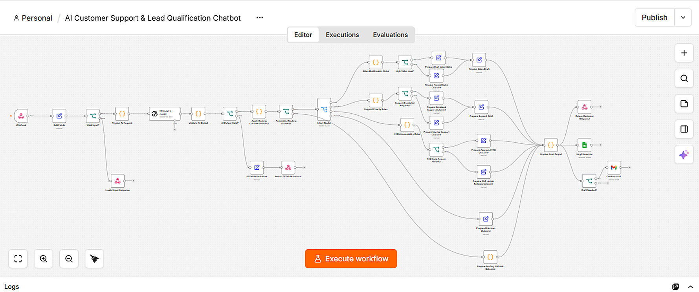
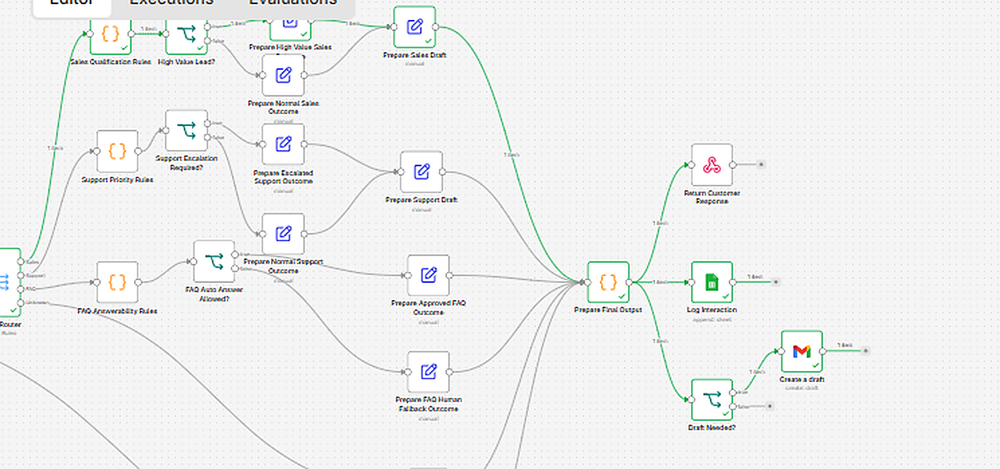
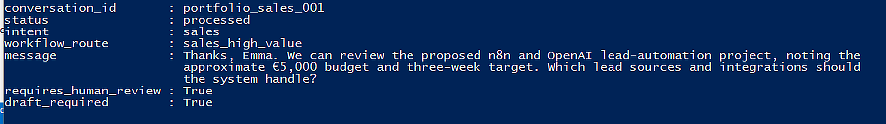
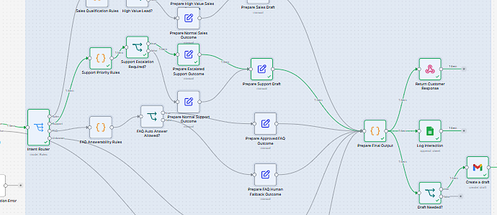
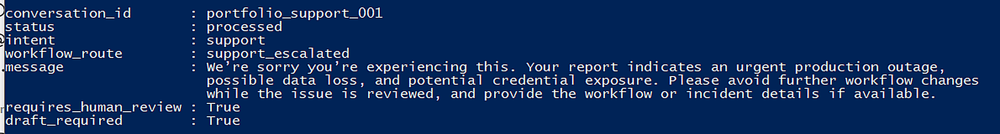
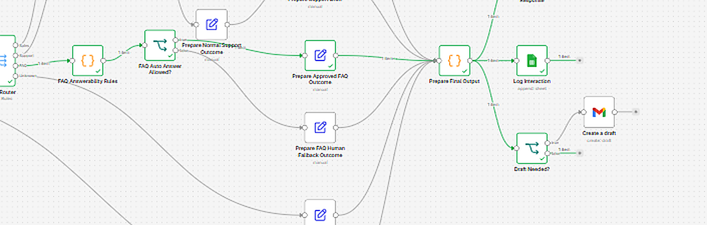
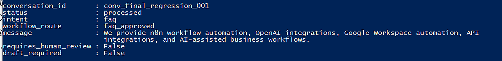
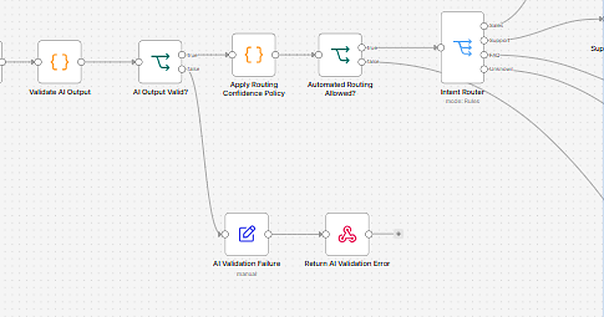
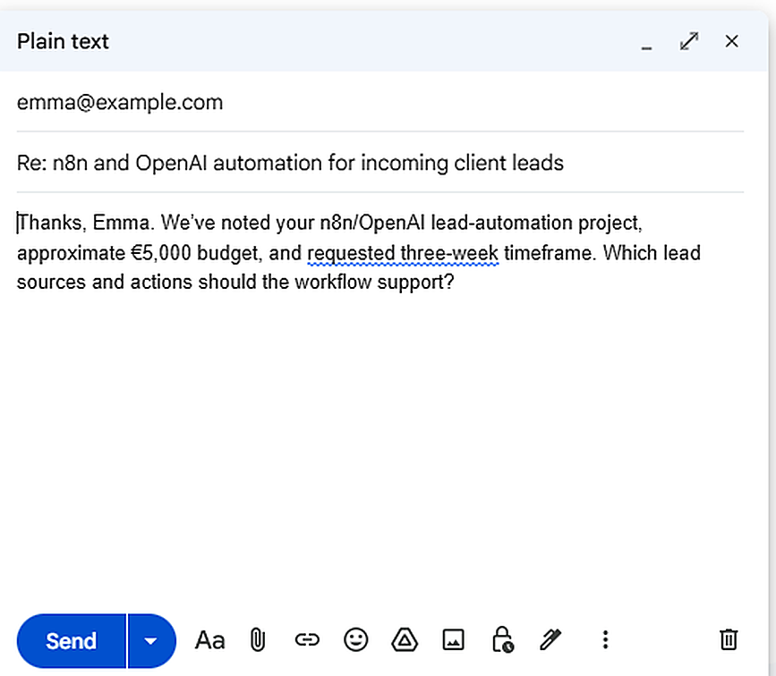
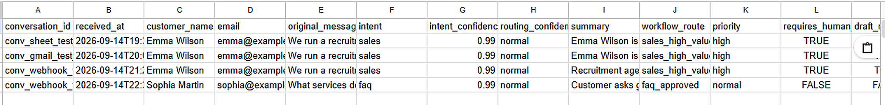

# AI Customer Support & Lead Qualification Chatbot

A governed n8n workflow for handling customer enquiries, sales leads, support incidents, and approved FAQs using structured AI analysis, deterministic routing, human-review gates, Google Sheets logging, and Gmail draft generation.

The project is designed to demonstrate more than basic chatbot automation. AI is used for structured interpretation, while consequential routing and communication decisions are constrained by explicit validation, confidence, scoring, and human-review rules.

## Workflow Overview



## What the Workflow Does

Incoming requests enter through an n8n webhook and pass through several control stages:

1. Input validation
2. Structured AI analysis
3. AI-output validation
4. Routing-confidence policy
5. Deterministic intent routing
6. Sales qualification, support prioritisation, FAQ validation, or clarification
7. Human-review decision
8. Google Sheets audit logging
9. Gmail draft creation when human review is required
10. Structured webhook response

## Supported Intent Routes

### Sales

Sales enquiries are scored using deterministic qualification rules based on signals such as:

- stated budget
- deadline
- urgency
- scope clarity

High-value opportunities are routed separately from normal sales enquiries.



Example API result:



---

### Support

Support requests are assessed using operational-impact signals including:

- service outage
- reported data loss
- security concerns
- business impact

Critical incidents are escalated for human review.



Example API result:



---

### FAQ

FAQs are not answered freely from model knowledge.

The workflow checks whether the question matches an enabled, approved FAQ source. Only supported answers may be returned automatically. Unsupported questions fall back to human review.



Example API result:



## Governance and Safety Controls

The workflow separates AI interpretation from operational authority.

Key controls include:

- strict input validation
- structured AI output
- schema/output validation
- confidence thresholds
- prompt-injection signalling
- deterministic routing rules
- approved FAQ allow-list
- human review for consequential communication
- explicit AI-validation failure handling
- no automatic sending of consequential email



## Human-in-the-Loop Communication

For routes requiring human review, the workflow prepares a Gmail draft rather than automatically sending a message.

This allows a human operator to inspect, edit, approve, or reject the proposed response.



## Audit Logging

Processed interactions are recorded in Google Sheets with fields including:

- conversation ID
- timestamp
- customer information
- intent
- confidence
- workflow route
- priority
- human-review requirement
- decision reason
- sales/support scores
- FAQ route
- draft status
- AI message ID



## Example Routing Outcomes

| Scenario | Route | Priority | Human Review | Draft |
|---|---|---:|---:|---:|
| €5,000 sales enquiry with 3-week target | `sales_high_value` | High | Yes | Yes |
| Critical outage with possible data loss/security exposure | `support_escalated` | Critical | Yes | Yes |
| Approved services FAQ | `faq_approved` | Normal | No | No |
| Ambiguous request | `unknown_clarification` | Normal | No | No |
| Unsupported FAQ | `faq_human_fallback` | Normal | Yes | Yes |

## Architecture

```text
Webhook
   ↓
Input Validation
   ↓
Structured AI Analysis
   ↓
AI Output Validation
   ↓
Routing Confidence Policy
   ↓
Intent Router
   ├── Sales
   │    └── Qualification → High Value / Normal
   │
   ├── Support
   │    └── Priority Assessment → Escalated / Normal
   │
   ├── FAQ
   │    └── Approved Answer / Human Fallback
   │
   └── Unknown
        └── Clarification
             ↓
       Prepare Final Output
          ↙        ↓        ↘
 Google Sheets   Webhook   Draft Gate
    Audit        Response      ↓
                            Gmail Draft
                         (human review)